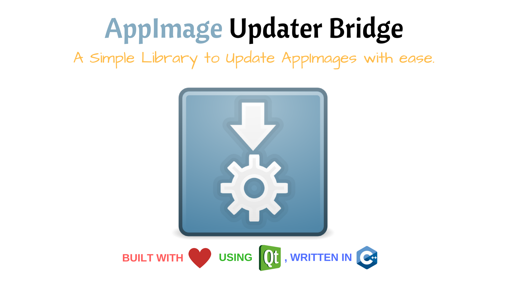

     

# AppImage Updater Bridge    

AppImage Updater Bridge is a **delta updater** based on the *zsync algorithm* for the *AppImage format* , Using this library you can 
delta update any AppImage file , That is , Only download the binary data which you need to get the latest version , 
Therefore saving your time and internet.

AppImage Updater Bridge is not the **official library** to do this stuff , The official library is [here](https://github.com/AppImages/AppImageUpdate) which is also written in **C++** but with no real **Qt support** , So thats why this library is built.

This library gives absolute support for *Qt* , Infact , All you need is the minimal installation of *Qt*(i.e, base ).

## Features

* *Single Threaded , Non-Blocking API* - Using Qt's Event Loop.(Optionally , You can use a seperate thread.)

* *Easy to Use API* - Made some effort to match Qt's style.

* *Cyclic API , No use of mutex* - The whole library is fully cyclic and therefore no mutex is used.(Only signals and slots.)

* *Pure C++* - Ported most of the legacy Zsync code to C++.

* *No third party libraries needed* - The reason why you want to use this library.

* *Drink the Qt Kool-aid*.

# Try it

See this library in **action** at this [repo](https://github.com/antony-jr/AppImageUpdater) which reimplements the official **AppImageUpdater Tool** with **Qt's** amazing **GUI** and my **design.**

# Getting Started

Please refer the official [documentation](https://antony-jr.github.io/AppImageUpdaterBridge).

# Acknowledgements 

* [AppImages](https://github.com/AppImages) - Motivation to start this project.
* [zsync](https://github.com/cph6/zsync) ([Colin Phipps](https://github.com/cph6)) - Zsync algorithm's author.
* [zsync2](https://github.com/AppImage/zsync2) ([@TheAssassin](https://github.com/TheAssassin)) - Helpful references.
* [Qt](https://github.com/qt)

# Support 

If you think that this project is **cool** then you can give it a :star: or :fork_and_knife: it if you want to improve it with me. I really :heart: stars though!   

# License

The BSD 3-clause "New" or "Revised" License.

Copyright (C) 2017 , antony jr.   
All Rights Reserved.
